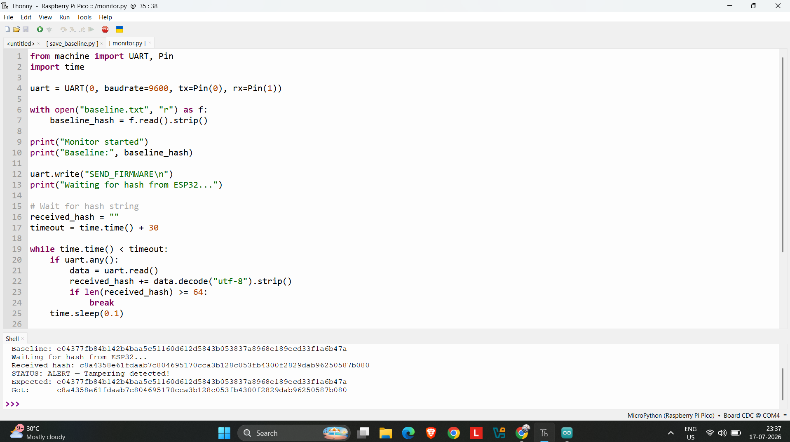
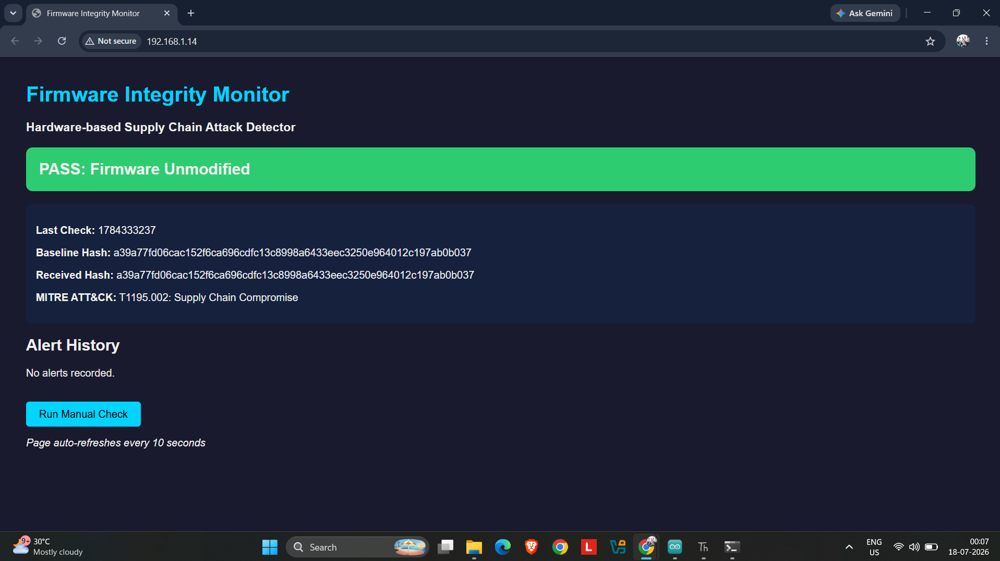
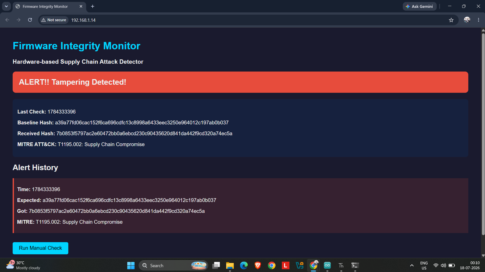

# Firmware Integrity Monitor
### Hardware-based Supply Chain Attack Detector | Raspberry Pi Pico W + ESP32

---

## What This Does

The Raspberry Pi Pico W acts as a trusted verifier that monitors an ESP32 microcontroller for firmware tampering. On each check cycle, the Pico W requests a SHA-256 hash of the ESP32's flash memory over UART and compares 
it against a cryptographically stored baseline. If even a single byte has changed, simulating a supply chain implant then the the system raises a timestamped alert and displays it on a live WiFi dashboard.

> Built to demonstrate detection of MITRE ATT&CK T1195.002 
> Supply Chain Compromise, flagged as a top UK threat by the NCSC.

---

## Demo Screenshots

| Clean Firmware | Tampered Firmware |
|---|---|
|  |  |

| Dashboard PASS | Dashboard ALERT |
|---|---|
|  |  |

---

## Architecture
ESP32 (Target Device)
│
│ UART (9600 baud)
│ Sends SHA-256 hash of own flash memory
▼
Raspberry Pi Pico W (Trusted Verifier)
│
├── Compares received hash against baseline.txt
├── Logs result with timestamp
│
├── PASS → green status on dashboard
└── ALERT → red alert on dashboard + logged as IoC
│
▼
WiFi Web Dashboard

---

## Hardware Required

| Component | Role |
|---|---|
| Raspberry Pi Pico W | Trusted verifier, runs monitoring logic |
| ESP32 DevKit v1 | Target device, firmware being monitored |
| 6x Male-to-Female jumper wires | UART + GND connections |

**Total additional cost: £0** — all hardware already owned.

---

## Wiring

| ESP32 Pin | Pico W Pin | Purpose |
|---|---|---|
| GPIO17 (TX) | GP1 (RX) | ESP32 → Pico data |
| GPIO16 (RX) | GP0 (TX) | Pico → ESP32 data |
| GND | GND | Shared ground |

---

## How To Run

1. Flash MicroPython onto Pico W
Download from micropython.org/download/RPI_PICO_W
Hold BOOTSEL, plug in USB, drag .uf2 file onto drive

2. Upload ESP32 firmware
Open `code/esp32_clean.ino` in Arduino IDE
Select ESP32 Dev Module, upload (hold BOOT during upload)

3. Establish baseline hash
Run `code/save_baseline.py` on Pico W via Thonny
This stores the known-good hash in `baseline.txt`

4. Run the monitor
Run `code/dashboard.py` on Pico W
Open the IP address shown in any browser

---

## Threat Model

| Attack Vector | Detected? | Notes |
|---|---|---|
| Modified firmware binary |  Yes | SHA-256 mismatch triggers alert |
| Added malicious function |  Yes | Any byte change detected |
| C2 server strings added | Yes | Demonstrated in tamper simulation |
| Pico W itself compromised | No | Requires hardware root of trust (TPM) |
| Hash function tampered | No | mbedtls runs on ESP32 — not independently verified |
| Replay attack | No | No challenge-response mechanism |

---

## MITRE ATT&CK Mapping

| Technique | ID | Relevance |
|---|---|---|
| Supply Chain Compromise | T1195 | Core threat this project detects |
| Compromise Software Supply Chain | T1195.002 | Specific sub-technique, firmware implant |
| Pre-OS Boot | T1542 | Firmware runs before OS, below traditional detection |
| Subvert Trust Controls | T1553 | Attacker subverts firmware trust |

---

## What I Learned

- SHA256 hashing and the avalanche effect: why even 1 byte change produces a completely different hash
- UART serial communication: TX/RX crossover, baud rate, flow control
- Firmware and flash memory: what firmware is, where it lives, why it's a target
- MicroPython memory constraints: implemented streaming/chunk-based hashing to work within 264KB RAM
- Hardware boot modes: ESP32 download mode vs running mode
- Binary reproducibility: why recompiling produces different hashes and how production systems use code signing to solve this
- Real debugging methodology: 9 distinct hardware/software bugs resolved across the full stack

---

## Limitations & Future Improvements

**Current limitations:**
- ESP32 computes its own hash: a compromised ESP32 could theoretically send a fake hash
- No challenge-response mechanism: vulnerable to replay attacks
- Monitoring is manual/periodic, not continuous

**To make this production-grade:**
- Use JTAG/SWD debug interface for independent flash reading
- Add hardware root of trust (TPM chip) on the verifier side
- Implement secure boot and code signing on ESP32
- Send alerts to a SIEM (Splunk/ELK) for centralised monitoring
- Add write-once forensic logging for chain of custody

---

## Files
firmware-integrity-monitor/
├── README.md
├── THREAT_MODEL.md
├── JOURNAL.md
├── code/
│ ├── esp32_clean.ino
│ ├── esp32_tampered.ino
│ ├── monitor.py
│ ├── dashboard.py
│ ├── save_baseline.py
│ └── secrets.py (Add your own WiFi credentials)
└── screenshots/
├── pass.png
├── alert.png
├── dashboard_pass.png
└── dashboard_alert.png

---
